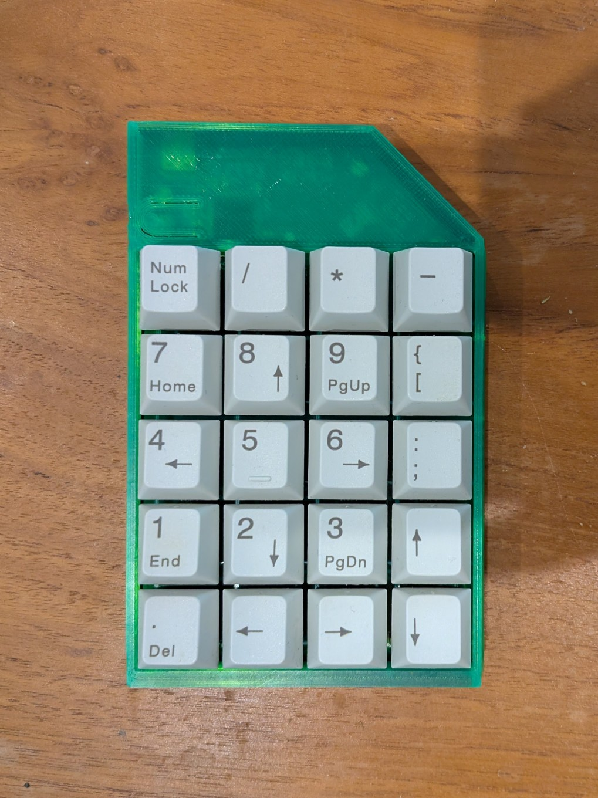

# TwentyPad
TwentyPad is a simple twenty-key macro pad, that I built to learn about PCB design.

This repository contains the KiCAD project for PCB manufacture and assembly. The case was [designed
in Onshape][onshape-proj].

onshape-proj: https://cad.onshape.com/documents/e1701c21a3cb18f7b5686e27/w/70a0bcde95206762f85e44bf/e/dfee6d06467dfd7de2e80397